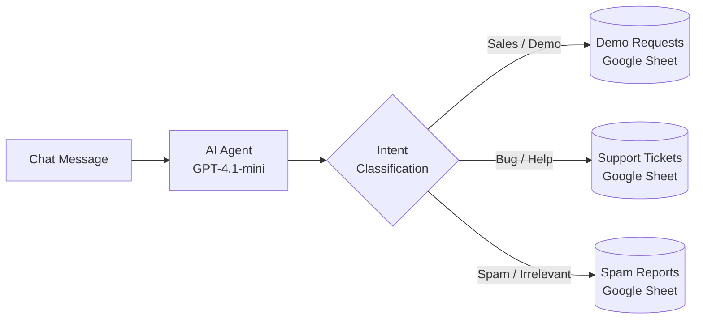

# Message Routing Agent

An LLM-powered agent that reads unstructured inbound messages, classifies intent at runtime, and routes each one to the correct system — as a single tool call.

## What it does

A user sends any message through a chat interface. The agent decides which of three categories it belongs to and appends a structured record to the corresponding Google Sheet.

- **Demo request** — booking a demo, pricing, or a sales conversation
- **Support ticket** — bugs, login issues, errors, billing problems, or a help request
- **Spam** — promotional, irrelevant, or off-topic content

No fixed workflow. No `if / else` tree hard-coded by a human. The routing happens through the LLM's judgment at runtime, guided by a system prompt.

## Architecture



The design pattern here is **Routing** — an agent evaluates input at runtime and picks the most appropriate next action, rather than executing a fixed sequence.

## Nodes

| Node | Purpose |
|------|---------|
| `When chat message received` | Chat trigger — entry point for inbound messages |
| `OpenAI Chat Model` | GPT-4.1-mini — the reasoning engine |
| `AI Agent` | Orchestrates the loop: read message → classify intent → call one tool |
| `Append support ticket` | Google Sheets tool — logs bugs / help requests |
| `Append to spam` | Google Sheets tool — logs spam / irrelevant messages |
| `Append to demo request` | Google Sheets tool — logs sales / demo inquiries |

The full system prompt is in [`prompts.md`](./prompts.md).

## How to import and run

1. **Install n8n locally** (free, self-hosted):
   ```bash
   docker run -it --rm --name n8n -p 5678:5678 -v n8n_data:/home/node/.n8n n8nio/n8n
   ```
   Then open `http://localhost:5678` in your browser.

2. **Import the workflow**: In n8n, go to Workflows → Import from File → select `workflow.json`.

3. **Create three Google Sheets** with these column headers:

   | Sheet | Columns |
   |-------|---------|
   | Support Tickets | User name, User email, Issue title, Issue description, Priority |
   | Spam Reports | Name, Email, Message content, Reason for spam |
   | Demo Requests | User name, User email |

4. **Set up credentials** in n8n:
   - OpenAI API key (Settings → Credentials → New → OpenAI)
   - Google Sheets OAuth (Settings → Credentials → New → Google Sheets)

5. **Wire up the sheet nodes**: open each of the three Google Sheets nodes and replace the placeholder document IDs with your own sheet IDs (the long string in the sheet URL). Point each node at the correct sheet and credential.

6. **Activate the workflow** and open the chat panel. Try inputs like:
   - *"Hi, I'd like to book a demo for our team of 20."* → Demo Requests
   - *"Login broken since morning, I can't reset my password."* → Support Tickets
   - *"AMAZING WEIGHT LOSS PILLS 50% OFF CLICK HERE"* → Spam Reports

## What I learned building it

Coming from a QA background, three things stood out:

1. **The prompt is the routing logic.** In a traditional system I'd write `if/else` branches and test each path. Here, the branching lives inside natural language instructions given to the model. That shifts testing from "does the code take the right branch" to "does the model interpret intent consistently across phrasings."

2. **"Use only one tool" is a design constraint that must be enforced twice** — once in the prompt, and again in how the agent is orchestrated. Without both, the agent occasionally calls multiple tools or none.

3. **Testing agentic systems means testing the joints, not just the endpoints.** The classical surfaces (does each tool work in isolation?) still matter, but the interesting failures happen in *how* the agent chains prompt → classification → tool selection → structured output. Those joints don't exist in traditional automation.

## Design decisions worth calling out

- **Structured output via `$fromAI()` field mapping** — the agent doesn't just decide *which* sheet to write to; it extracts named fields (user, email, priority, reason) from unstructured input. This makes downstream systems consume clean records.
- **Chat trigger as entry point** — chosen for iterative testing during development. In production, this would be swapped for a webhook, email inbound, or form submission.
- **Exactly-one-tool enforcement** — the prompt explicitly says "use only one tool" to prevent duplicate log entries when the message is ambiguous.

## Stack

- **Orchestration**: n8n (self-hosted, free)
- **LLM**: OpenAI GPT-4.1-mini
- **Storage**: Google Sheets (via OAuth2)

## License

MIT.
