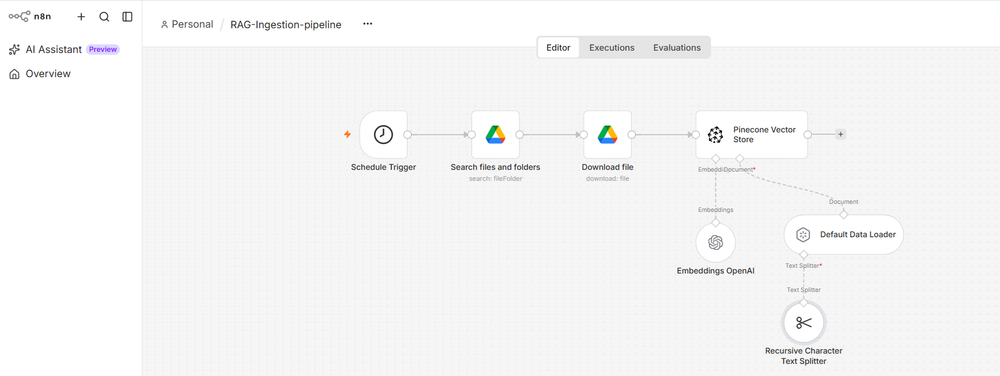
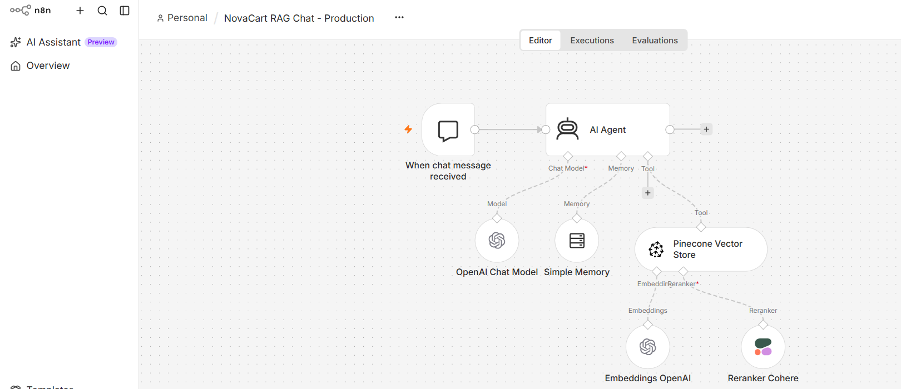
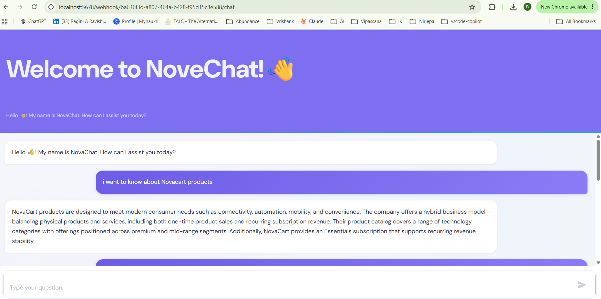
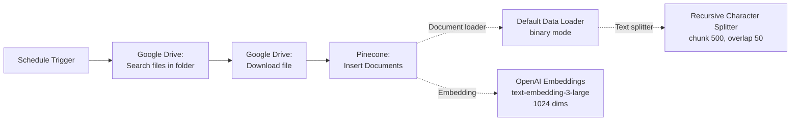
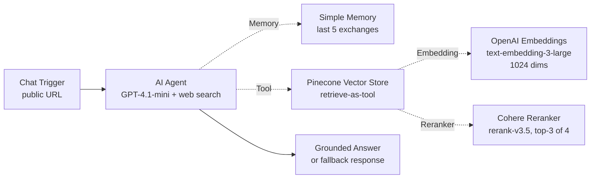

# RAG Knowledge Agent — NovaCart

A grounded, retrieval-augmented chat assistant built on n8n. It answers business questions strictly from a curated set of internal documents — no hallucination, with a hard fallback when the knowledge base does not contain the answer.

> Case study company: NovaCart. The problem statement, documents, and metrics are used as a realistic case study for building the pattern. The workflow itself is fully reusable for any private knowledge base.

## What it does

Two connected pipelines make up the system:

1. **Ingestion pipeline** — runs on a schedule, pulls documents from a Google Drive folder, chunks and embeds them, and inserts the vectors into a Pinecone index.
2. **Chat pipeline** — a public chat interface where users ask questions. An AI Agent orchestrates: retrieve from Pinecone (with Cohere reranking) → answer strictly from retrieved content → fall back to a canned "I don't have that" response if the retrieval is empty or off-topic → optionally use web search for cross-vendor comparisons.

The two pipelines share the same embedding model and Pinecone index, which is what makes retrieval work — the query embedding must live in the same vector space as the ingested documents.

## Live workflow

**Ingestion pipeline in n8n — Google Drive → Pinecone via OpenAI embeddings:**



**Chat pipeline in n8n — AI Agent with retrieval, memory, and Cohere reranker:**



**NoveChat answering a grounded question — response comes only from indexed NovaCart documents:**



## Architecture

### Ingestion pipeline



### Chat / retrieval pipeline



## Design decisions worth calling out

- **Same embedding model on both sides.** The ingestion pipeline and the query pipeline both use `text-embedding-3-large` at 1024 dimensions. If these ever drift, retrieval breaks silently — queries land in a different vector space than the documents. This is one of the most common RAG failure modes and it's easy to miss because nothing errors: results just get worse.
- **Retrieve-as-tool, not retrieve-directly.** The Pinecone node is exposed to the agent as a *tool* it decides to call, not as a fixed step in the pipeline. This lets the agent skip retrieval on pure greetings ("hi", "hello") and use its judgment on multi-turn conversations.
- **Reranker on top of vector search.** Vector search returns the top 4 chunks by cosine similarity. The Cohere reranker re-scores those 4 using a cross-encoder that reads query and chunk together, then passes only the top 3 to the LLM. This measurably improves grounding by filtering out chunks that are lexically close but semantically off.
- **Hard-coded fallback string.** The system prompt requires the exact response *"I'm sorry, I don't have that information in my knowledge base..."* when retrieval comes up empty. This is deliberately not left to the LLM's judgment — a canned fallback is the difference between a trustworthy assistant and one that quietly hallucinates.
- **Web search as an escape valve.** GPT-4.1-mini's built-in web search is enabled, but the system prompt scopes it narrowly to cross-vendor comparisons. Everything else must come from the vector store.
- **Namespace as a partition boundary.** Both pipelines use `production` as the Pinecone namespace. Switching namespaces gives you clean separation between environments (production, staging, experiments) inside a single index.

## Nodes

### Ingestion pipeline

| Node | Purpose |
|------|---------|
| Schedule Trigger | Runs the pipeline on a fixed cadence (e.g., daily) |
| Google Drive — Search files and folders | Lists all files in the source folder |
| Google Drive — Download file | Downloads each file's binary content |
| Pinecone Vector Store (Insert) | Writes embedded chunks into the vector index |
| Default Data Loader | Handles binary parsing (PDFs, DOCX) |
| Recursive Character Text Splitter | Chunks text (500 chars, 50 overlap) |
| OpenAI Embeddings | Generates 1024-dim embeddings |

### Chat pipeline

| Node | Purpose |
|------|---------|
| Chat Trigger (public) | User-facing chat interface with custom branding |
| AI Agent | Orchestrates: retrieve → answer or fall back |
| OpenAI Chat Model (GPT-4.1-mini) | Reasoning engine with built-in web search |
| Simple Memory | Retains last 5 exchanges per session |
| Pinecone Vector Store (Retrieve-as-tool) | Semantic retrieval exposed to the agent |
| OpenAI Embeddings | Vectorizes the query for retrieval |
| Cohere Reranker (rerank-v3.5) | Re-scores top-4 → top-3 for grounding quality |

The full system prompt is in [`prompts.md`](./prompts.md).

## How to import and run

### Prerequisites

You'll need accounts and API keys for:

- **OpenAI** (for the LLM and embeddings) — [platform.openai.com](https://platform.openai.com)
- **Pinecone** (vector database — free tier works) — [pinecone.io](https://www.pinecone.io)
- **Cohere** (reranker — free tier works) — [cohere.com](https://cohere.com)
- **Google Drive** (source documents) — OAuth via Google Cloud Console

And a running n8n instance (self-hosted, free):

```bash
docker run -it --rm --name n8n -p 5678:5678 -v n8n_data:/home/node/.n8n n8nio/n8n
```

Or via npx (lighter, no Docker):

```bash
npx n8n
```

Then open `http://localhost:5678`.

### Step-by-step

1. **Create a Pinecone index.** In the Pinecone console: New index → name it whatever you want → **Dimensions: 1024** → **Metric: cosine** → Cloud/region: any → Create. Note the index name.

2. **Create a Google Drive folder** with the documents you want the agent to answer questions about. Note the folder ID (in the folder's URL: `https://drive.google.com/drive/folders/YOUR_FOLDER_ID`).

3. **Import both workflows into n8n:**
   - Workflows → Create workflow → Import from File → select `ingestion-workflow.json`
   - Workflows → Create workflow → Import from File → select `chat-workflow.json`

4. **Configure credentials** in n8n (Settings → Credentials → New) for:
   - OpenAI API
   - Pinecone API
   - Cohere API
   - Google Drive OAuth2 (redirect URI: `http://localhost:5678/rest/oauth2-credential/callback`)

5. **Wire the ingestion pipeline:**
   - Open `Search files and folders` → point Folder at your Drive folder
   - Open `Download file` → attach Google Drive credential
   - Open `Pinecone Vector Store` → set index to yours, namespace `production`, attach Pinecone credential
   - Open `Embeddings OpenAI` → attach OpenAI credential

6. **Wire the chat pipeline:** open each node and attach the matching credential. Set the Pinecone index name to match your ingestion index. Verify namespace is `production` in both.

7. **Apply the custom chat styling** (optional but recommended for a polished look):
   - Open the `When chat message received` node in the chat workflow
   - Options → **Custom Chat Styling**
   - Paste the entire contents of [`chat-styling.css`](./chat-styling.css) into that field
   - Save

8. **Run ingestion once manually** to populate Pinecone: open the ingestion workflow → Execute workflow. Watch each node turn green. Check the Pinecone console — you should see vectors appearing under the `production` namespace.

9. **Activate the chat workflow:** top-right toggle → Active. Copy the Chat URL from the Chat Trigger node.

10. **Open the Chat URL** in a new tab. Ask questions about your indexed content — you should get grounded answers with the NoveChat branding.

## What I learned building it

Building a real RAG pipeline (as opposed to reading about one) surfaced several quality-engineering realizations:

1. **Silent vector-space drift is the scariest RAG bug.** If ingestion and retrieval use different embedding models or different dimension counts, retrieval quietly degrades — no error, just worse answers. There's no unit test that catches this; the check has to be an explicit config assertion.

2. **The reranker earns its keep on ambiguous queries.** Vector similarity alone often returns chunks that share vocabulary with the query but not meaning. The cross-encoder reranker consistently promoted better chunks in my tests. This is the difference between "the answer is in the top 10" and "the answer is in the top 3."

3. **Grounding fails at the seams, not the parts.** Each component (retrieval, ranking, generation) can be individually correct while the overall answer is still ungrounded — the LLM interprets the retrieved context "creatively." A strict, exact-match fallback string forces the failure to be visible instead of invisible.

4. **Chunking strategy is a QE contract.** 500-char chunks with 50 overlap works well for prose documents but is wrong for tabular data (splits rows) and code (splits blocks). Different document types need different chunking, and that decision should be documented as part of the ingestion contract — not buried in a node configuration.

5. **Testing a RAG system is not just testing the happy path.** The interesting test cases are: questions the KB *shouldn't* answer, questions whose data lives across multiple documents, questions where the retrieved chunks contain contradictions. These are where grounding claims get stress-tested.

## Stack

- **Orchestration**: n8n (self-hosted, free)
- **LLM**: OpenAI GPT-4.1-mini (with built-in web search)
- **Embeddings**: OpenAI `text-embedding-3-large` @ 1024 dimensions
- **Vector store**: Pinecone (namespace `production`)
- **Reranker**: Cohere `rerank-v3.5` (top-3 of 4)
- **Memory**: Simple Memory buffer window (5 exchanges)
- **Document source**: Google Drive
- **Chat UI**: n8n Hosted Chat with custom CSS theme

## Files in this folder

- `ingestion-workflow.json` — sanitized ingestion pipeline (importable into n8n)
- `chat-workflow.json` — sanitized chat/retrieval pipeline (importable into n8n)
- `chat-styling.css` — custom CSS theme for the chat interface
- `prompts.md` — system prompt for the AI Agent, with design notes
- `README.md` — this file

## License

MIT.
