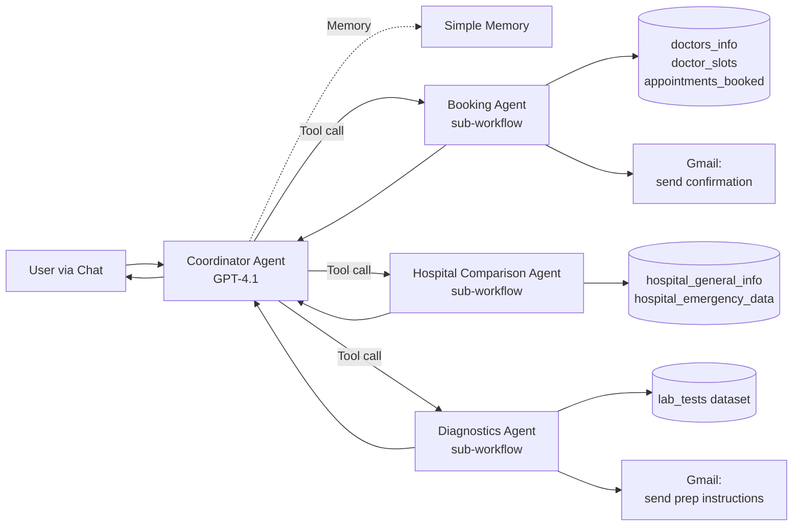
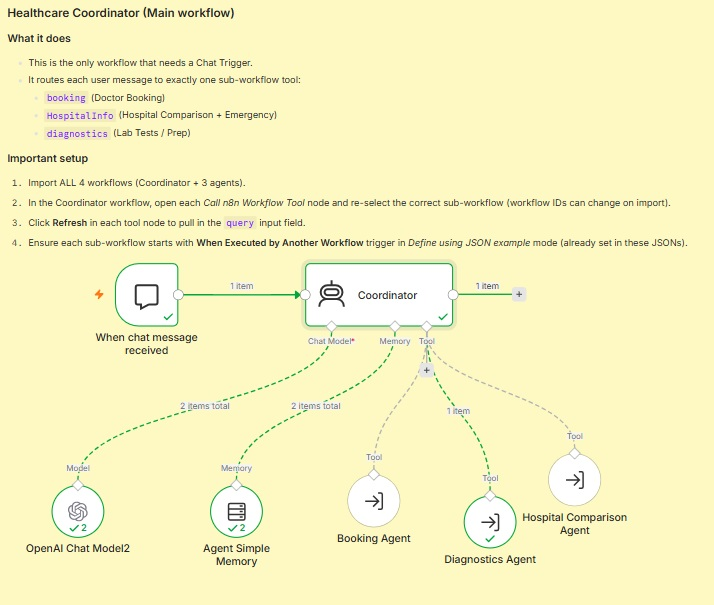
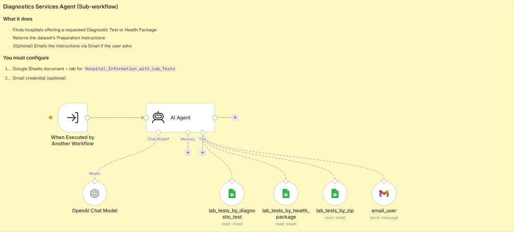
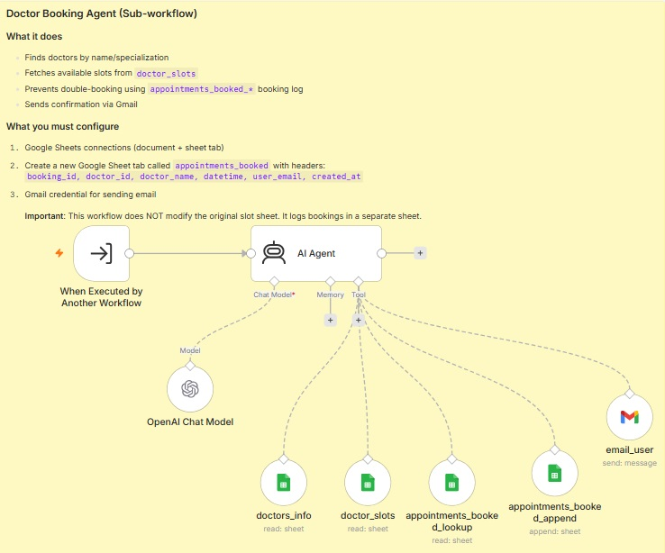
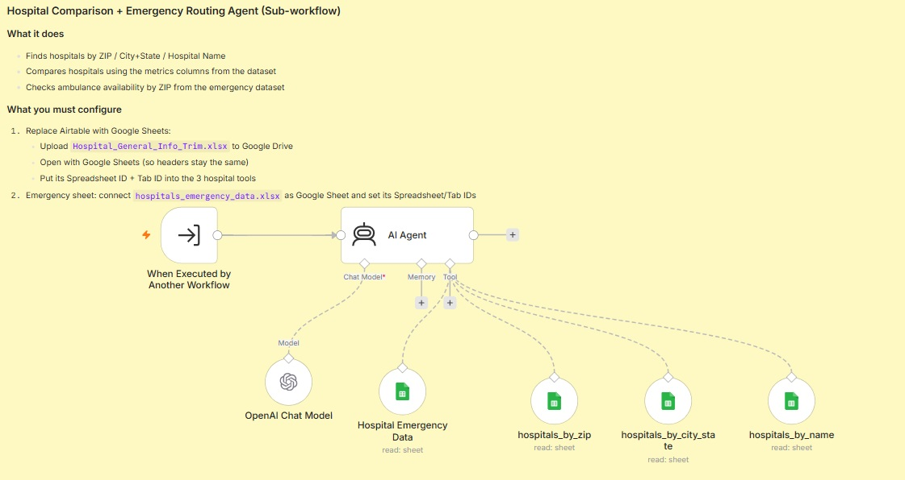

# Healthcare Multi-Agent System

A coordinator agent that routes user requests to one of three specialist sub-agents — for booking doctors, comparing hospitals (with emergency routing), and finding diagnostic tests / health packages. Built on n8n using the sub-workflow-as-tool pattern.

> Case study: this is a demo healthcare assistant. The datasets (doctors, slots, hospital metrics, lab tests) are illustrative — the architecture and design decisions are the transferable part.

## What it does

A single chat interface where users can ask any healthcare-related question. The Coordinator agent classifies intent and calls exactly one specialist agent to handle the request:

- *"Book me a cardiologist appointment next Tuesday"* → Booking Agent
- *"Which hospitals in ZIP 94404 have the best cardiology ratings?"* → Hospital Comparison Agent
- *"I need an MRI Scan — how should I prepare?"* → Diagnostics Agent

The specialist agent returns a grounded answer sourced only from the connected Google Sheets datasets. Each sub-agent has its own tools, its own system prompt, and its own guardrails — the Coordinator never sees the data, only the specialist's final answer.

## Architecture



Each sub-agent is its own n8n workflow with a `When Executed by Another Workflow` trigger, called via the Coordinator's `Call n8n Workflow Tool` nodes.

## Live workflow

*[Placeholder — I'll add a screenshot of a full chat interaction once my OpenAI rate limit resets. In the meantime, the four canvas screenshots below show each workflow's structure.]*

**Coordinator workflow (main entry point):**


**Diagnostics Agent sub-workflow:**


**Booking Agent sub-workflow:**


**Hospital Comparison Agent sub-workflow:**


## Design decisions worth calling out

- **Coordinator does routing, not execution.** The Coordinator's system prompt has no domain knowledge about diagnostics, bookings, or hospitals. It only decides which specialist to call. That separation lets each sub-agent evolve independently — a change to the Booking Agent's tools does not require re-testing the Coordinator's routing logic.
- **Tool description IS the routing logic.** Each Call-Workflow tool node's description (the text the Coordinator sees) is what determines which tool the LLM picks. Vague descriptions cause mis-routing. Sharp, boundary-defining descriptions (see [`prompts.md`](./prompts.md)) are the difference between a router that works and one that guesses.
- **The `query` field description is a second contract.** Each tool node's `query` field has its own AI-facing description ("The user's request to find a doctor..."). This tells the Coordinator not just *which* tool to call but *how to phrase the query* to the specialist. Without it, the Coordinator often passes garbage or the raw user text.
- **`Define using JSON example` mode is mandatory.** The `When Executed by Another Workflow` trigger in each sub-workflow must be in this mode with a `{ "query": "example" }` schema. Otherwise the Coordinator's tool node cannot expose "Defined automatically by the agent" as an input option — you're stuck with fixed strings, and dynamic routing breaks.
- **Every sub-workflow must be Active (Published).** A sub-workflow that is Inactive returns `"Workflow is not active and cannot be executed"` at call time, even if the Coordinator's routing was perfect. This is the single most common way multi-agent setups fail on first run.
- **Read-only source data + append-only booking log.** The Booking Agent explicitly does not modify the source `doctor_slots` sheet. Bookings are logged to a separate `appointments_booked` sheet, and double-booking is prevented by checking that log before confirming. This preserves the source-of-truth invariant that traditional QA cares about.
- **Domain-specific safety guardrails per agent.** The Diagnostics Agent's prompt explicitly says *"You are not a doctor and must not diagnose or provide medical advice."* Booking Agent has *"Never guess the user's email — ask for it."* These aren't shared across agents because each specialist has different risks.

## Sub-agent capabilities

### Booking Agent
- Finds doctors by name or specialization (`doctors_info` sheet)
- Fetches available slots (`doctor_slots` sheet, filtered by `is_available = 1`)
- Prevents double-booking via `appointments_booked_lookup`
- Logs confirmed bookings to `appointments_booked_append`
- Sends confirmation via Gmail

### Hospital Comparison Agent
- Finds hospitals by ZIP, City+State, or exact name
- Ranks hospitals using metrics: overall rating, mortality/safety/readmission/patient-experience national comparisons
- Checks ambulance availability from a separate emergency dataset
- Text-only output, no charts (constraint)

### Diagnostics Agent
- Finds hospitals offering specific Diagnostic Tests (Blood Test, CT Scan, ECG, MRI, Ultrasound, X-Ray, etc.)
- Finds hospitals offering specific Health Packages (Cancer Screening, Full Body Checkup, Heart Care, etc.)
- Returns Preparation Instructions exactly as stored in the dataset
- Optionally emails prep instructions via Gmail
- Refuses to diagnose or recommend tests based on symptoms

The full system prompts and tool descriptions are in [`prompts.md`](./prompts.md).

## How to import and run

### Prerequisites

- **OpenAI** API key with GPT-4.1 access — [platform.openai.com](https://platform.openai.com)
- **Google account** with Sheets and Gmail — for the datasets and confirmation emails
- **n8n** running locally (self-hosted):
  ```bash
  npx n8n
  ```
  Then open `http://localhost:5678`.

### Setup order (matters)

1. **Prepare the Google Sheets datasets.** You need spreadsheets for:
   - Doctors info (columns: `id, name, specialization, contact`)
   - Doctor slots (columns: `id, doctor_id, datetime, is_available`)
   - Appointments booked log (columns: `booking_id, doctor_id, doctor_name, datetime, user_email, created_at`)
   - Lab tests / hospital info (columns include `Hospital Name, Address, City, State, ZIP Code, Phone Number, Diagnostic Test, Health Package, Preparation Instructions`)
   - Hospital general info (columns include `Hospital Name, City, State, ZIP Code, Phone Number, Hospital overall rating, Emergency Services`, and the national-comparison columns)
   - Hospital emergency data (columns include `Zip Code, Ambulance Available`)

2. **Import all 4 workflows into n8n:**
   - `coordinator-workflow.json`
   - `diagnostics-agent-workflow.json`
   - `booking-agent-workflow.json`
   - `hospital-comparison-agent-workflow.json`

3. **Configure credentials** (Settings → Credentials → New):
   - OpenAI API
   - Google Sheets OAuth2
   - Gmail OAuth2

4. **Wire each sub-workflow's Google Sheets nodes** to the correct sheet document + tab, and attach the credentials. Each `REPLACE_WITH_YOUR_..._SHEET_ID` placeholder needs to be replaced with your actual sheet ID.

5. **Activate (Publish) all 3 sub-workflows** — top-right toggle. This step is critical. A sub-workflow that is Inactive cannot be called by the Coordinator, and the error you get at runtime is unhelpful.

6. **In the Coordinator workflow**, open each of the 3 `Call n8n Workflow Tool` nodes and:
   - Re-select the correct sub-workflow from the dropdown (workflow IDs are regenerated on import, so the stored references don't survive).
   - Click the `⋮` menu → **Refresh Workflow input List**.
   - Verify the `query` field appears with **"Defined automatically by the agent"** as an option.

7. **Activate the Coordinator** and open its Chat URL from the Chat Trigger node.

8. **Test with three probe queries** — one per agent:
   - *"I need a CBC blood test — how should I prepare?"* → Diagnostics
   - *"Book me a cardiologist appointment next Tuesday"* → Booking
   - *"Which hospitals in ZIP 94404 have the best cardiology ratings?"* → Hospital Comparison

## What I learned building it

Multi-agent orchestration surfaces failure modes single-agent systems don't have. The interesting ones are all at the **seams** between agents:

1. **Tool description is prompt engineering.** The two most important pieces of text in the whole system are: (a) each tool node's description, which the Coordinator uses to decide which specialist to call, and (b) each `query` field's description, which tells the Coordinator how to phrase the specialist call. Get either wrong and the whole system produces confident-sounding nonsense.

2. **Schema discovery is timing-sensitive.** If a tool node in the Coordinator was created before the sub-workflow's trigger schema was configured, the node gets stuck in "manual input" mode even after the trigger is fixed. Deleting and re-adding the tool node was the reliable fix. Silent state that survives a fix is the exact class of bug traditional QE learns to sniff out.

3. **Sub-workflow activation is a load-bearing config invisible from the caller.** The Coordinator's routing worked perfectly on my first test, but two of the three sub-agents returned *"Workflow is not active and cannot be executed"*. From the outside it looked like the agents were broken. From the inside, a single toggle per sub-workflow fixed it. In a QE lens: any config that lives outside the caller but silently breaks the caller's contract needs to be visible in the caller's diagnostic output.

4. **The Coordinator is the routing test surface.** The way to test whether tool descriptions are sharp enough is to send a *deliberately ambiguous* query and see which specialist gets picked. That's the analog of mutation testing at the routing layer. If the same ambiguous query routes to different specialists across runs, your descriptions have unresolved overlap.

5. **Rate limits become visible at multi-agent scale.** A single chat message in this system triggers 2-3 LLM calls (Coordinator + specialist + potentially tool calls that involve embedding-like reasoning). What was 1 request/message in Week 1 became 3-4 requests/message here. OpenAI's per-minute rate limits show up much faster. A QE-relevant fact: the observability layer for multi-agent systems needs to count LLM calls per user message, not just LLM calls per second.

## Stack

- **Orchestration**: n8n (self-hosted, free)
- **Coordinator LLM**: OpenAI GPT-4.1
- **Sub-agent LLMs**: OpenAI GPT-4.1 (each sub-agent has its own instance)
- **Memory**: Simple Memory buffer window (on Coordinator only)
- **Data**: Google Sheets (multiple spreadsheets)
- **Communication**: Gmail (for confirmations and prep instructions)
- **Pattern**: Sub-workflow-as-tool (n8n's `toolWorkflow` node type)

## Files in this folder

- `coordinator-workflow.json` — the main entry point workflow (chat trigger + coordinator + 3 tool nodes)
- `booking-agent-workflow.json` — Booking sub-workflow (5 tools + Gmail)
- `hospital-comparison-agent-workflow.json` — Hospital sub-workflow (4 sheet tools)
- `diagnostics-agent-workflow.json` — Diagnostics sub-workflow (3 sheet tools + Gmail)
- `prompts.md` — all system prompts and tool descriptions, with design commentary
- `workflow-coordinator.png` — canvas screenshot of the coordinator
- `workflow-booking.png` — canvas screenshot of the booking agent
- `workflow-hospital.png` — canvas screenshot of the hospital comparison agent
- `workflow-diagnostics.png` — canvas screenshot of the diagnostics agent
- `README.md` — this file

## License

MIT.
