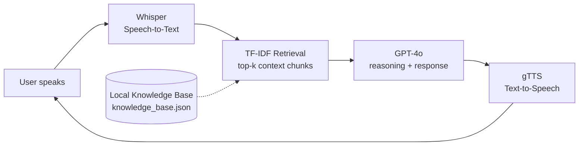
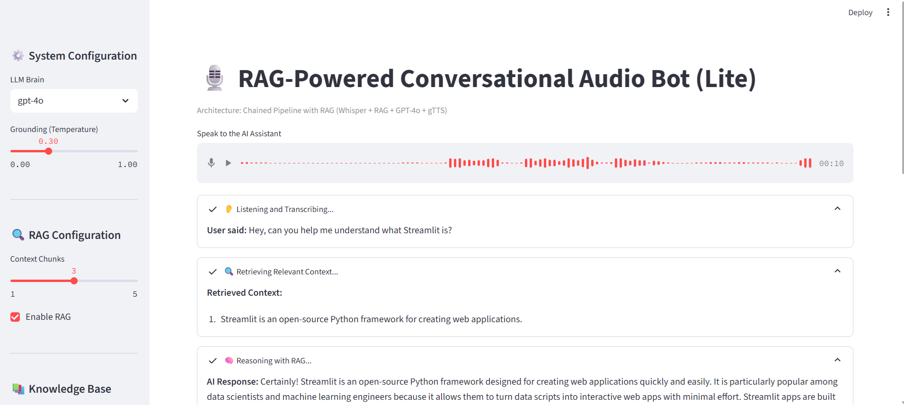
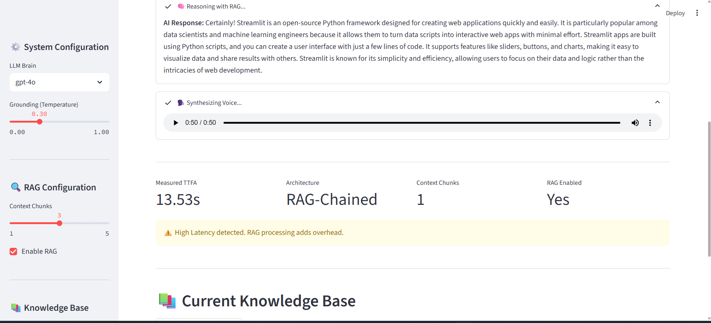
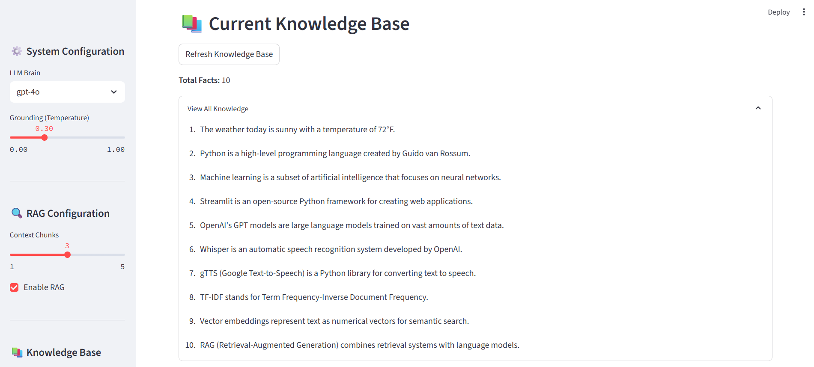

# Conversational Audio Bot — Chained RAG Pipeline

A voice-first conversational assistant built in Python / Streamlit. You speak into the mic, it transcribes, retrieves relevant context from a local knowledge base, reasons over it, and speaks the answer back. Everything runs locally; only the OpenAI calls hit the network.

This is a deliberately *chained* architecture — each stage waits on the previous. That makes it simple to reason about and expensive on latency. The latency choice is the point.

## What it does

- You click the mic, speak a question
- **Whisper** transcribes your audio to text
- **TF-IDF retrieval** finds the top-k most relevant facts from the local knowledge base
- **GPT-4o** reasons over the retrieved context and produces an answer
- **gTTS** turns the answer back into speech, which auto-plays
- A performance panel shows the measured TTFA (Time to First Audio) and warns if latency exceeds the conversational threshold

## Architecture



Four sequential stages. Each one has to finish before the next can start. This is the simplest voice architecture to prototype and the most expensive to run at low latency.

## Live demo

**System configuration (sidebar) and audio input:**



**Full pipeline running — transcription, retrieval, reasoning, synthesis, and the measured TTFA:**



**Knowledge base viewer — the facts the agent is grounded against:**


Measured TTFA on my machine: **13.53 seconds** against a target of 1.5s. The gap isn't a bug — it's the architecture. Chained pipelines accumulate latency at every stage.

## Design decisions worth calling out

- **Chained, not streaming.** This architecture is the honest beginner-friendly pattern: ASR finishes, then RAG runs, then LLM reasons, then TTS speaks. Production voice systems (ElevenLabs Conversational AI, OpenAI Realtime API, Vapi, Pipecat) stream through all stages concurrently — they start speaking the beginning of the answer while the model is still generating the end. Streaming is where the production bar lives, and it's a materially harder engineering problem.
- **TF-IDF for RAG, not semantic embeddings.** Deliberate speed/accuracy trade. TF-IDF is near-instant and good enough for a 10-fact demo KB. Swap to OpenAI embeddings + a vector store (FAISS, Chroma) when the corpus grows past a few hundred items.
- **Temperature slider as a quality knob.** Lower temperature → more deterministic, more grounded in retrieval. Higher → more creative, more hallucination surface. Exposing this to the user makes the trade-off tangible.
- **RAG is optional, not mandatory.** The "Enable RAG" checkbox lets you A/B the system against a baseline (no retrieval). Useful for seeing when RAG actually improves the answer vs just adding latency.
- **The latency warning is honest.** The app surfaces a "High Latency detected" message when TTFA exceeds 1.5s. Most demos hide this; this one makes it the first thing you notice. In a voice system, latency *is* a quality attribute.

## How to run

### Prerequisites

- Python 3.11 (or similar modern version)
- OpenAI API key with access to `whisper-1` and `gpt-4o` / `gpt-4o-mini`
- FFmpeg installed (needed for audio handling on some systems)

### Setup

```bash
# 1. Clone / download this folder
cd 04-conversational-audio-bot

# 2. Create a virtual environment
python -m venv venv

# 3. Activate it
# Windows:
venv\Scripts\activate
# macOS / Linux:
source venv/bin/activate

# 4. Install dependencies
pip install -r requirements.txt

# 5. Create a .env file with your OpenAI key
echo OPENAI_API_KEY=sk-your-key-here > .env

# 6. Run the app
streamlit run audio_app.py
```

The app opens at `http://localhost:8501` by default. Click the microphone, speak, wait for the full pipeline to run.

### Install FFmpeg (if audio errors appear)

- **Windows**: download from [ffmpeg.org](https://ffmpeg.org/download.html) and add to PATH
- **macOS**: `brew install ffmpeg`
- **Linux**: `sudo apt install ffmpeg`

## What I learned building it

Voice agents have a different quality rubric than text-chat agents. A few things that landed from a QE lens:

1. **Latency is a quality attribute, not an optimization concern.** In chat, a 2-second pause is annoying. In voice, it's conversation-breaking. Humans perceive turn-taking at under ~1.5s; above that, we interpret the silence as the bot having nothing to say.

2. **Chained vs streaming is where prototypes diverge from production.** Every voice agent is secretly a bet on this choice. Prototypes are almost always chained (fast to build, slow to run). Production systems are streaming (hard to build, fast to run). Switching from one to the other is where most of the real voice-agent engineering lives.

3. **RAG costs more in voice than in text.** The retrieval pause is audible in a voice system — a visible beat of silence before the agent speaks. The same pause in a chat UI is invisible. The "is this retrieval worth it?" calculation has a different answer when the user is listening for silence.

4. **Modality adds quality dimensions correctness doesn't cover.** Pacing, warmth, hesitations, the length of the turn-boundary silence — none of these matter for a text UI, all of them matter for voice. Testing voice agents means caring about things traditional QA never had to.

5. **A performance panel is a QE primitive.** Surfacing measured TTFA directly in the UI, with a visible warning when it exceeds the budget, makes latency a first-class concern instead of a buried metric. This same pattern — explicit visible SLOs in the user-facing surface — generalizes to any AI system.

## Stack

- **Frontend**: Streamlit
- **ASR**: OpenAI Whisper (`whisper-1`)
- **Retrieval**: TF-IDF via scikit-learn
- **LLM**: OpenAI GPT-4o (configurable: `gpt-4o`, `gpt-4o-mini`)
- **TTS**: gTTS (Google Text-to-Speech)
- **Vector store**: Local numpy array (sufficient for small KBs)

## Files in this folder

- `audio_app.py` — the Streamlit application
- `requirements.txt` — Python dependencies
- `.gitignore` — excludes `.env`, generated artifacts
- `demo-top.png` — screenshot of sidebar + audio input
- `demo-pipeline.png` — screenshot of the full pipeline executing
- `demo-knowledge-base.png` — screenshot of the knowledge base viewer
- `README.md` — this file

## License

MIT.
